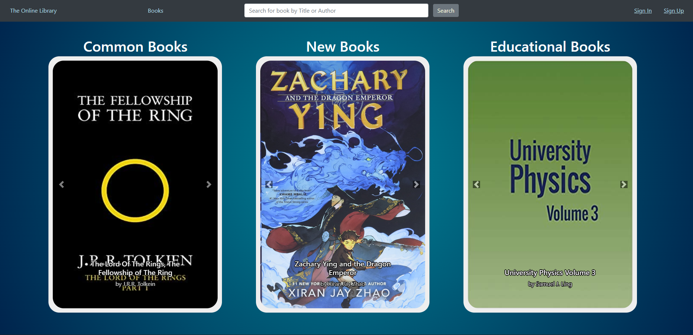

# OnlineLibrary

The website can be accessed [here!](https://mazen-ghaleb.github.io/OnlineLibrary/index.html "Project's Git Page Link")

## Description

This website is made to simulate an online library where users can checkout which books are available, and admins can manage the books and the users.

### How to run ?

There are three methods to run the website

1. Run the index.html file.
2. Run as Live server from VScode.
3. Run through the deployment on GitPages.

### How to test ?

 

To test using an admin account the following credentials can be used.

Email: admin@admin.com

Password: admin

 

To test using a normal account the following credentials can be used.

Email: jdoe@gmail.com

Password: doeD0Edoe

 
